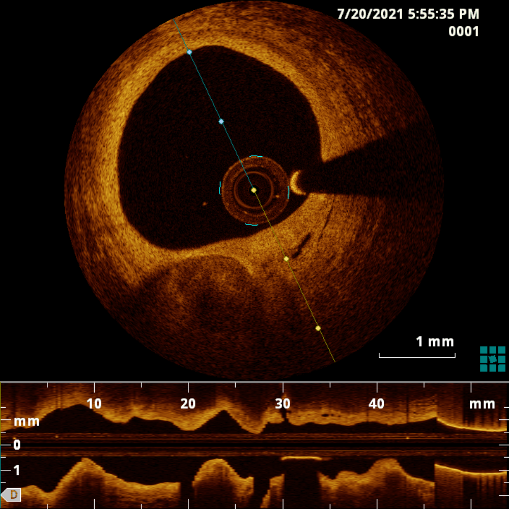
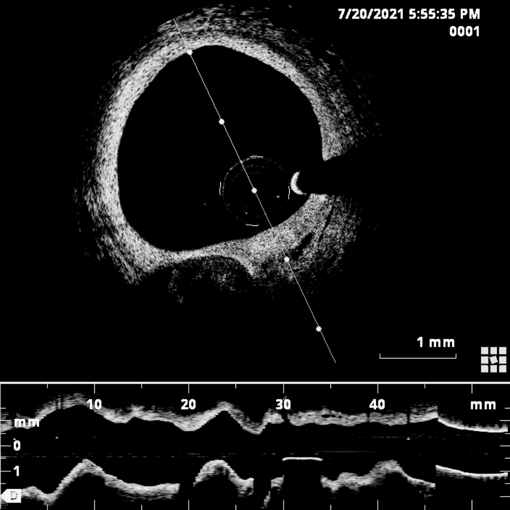

# Segmentation and analysis of OCT images
This repository is dedicated to the segmentation of [optical coherence tomography](https://en.wikipedia.org/wiki/Optical_coherence_tomography) (OCT) images and the analysis of the plaques that appear on them.

<a name="table-of-contents"></a>
## 📖 Table of Contents
- [Requirements](#requirements)
- [Installation](#installation)

<a name="requirements"></a>
## 💻 Requirements

- Operating System
  - [x] macOS
  - [x] Linux
  - [x] Windows (limited testing carried out)
- Python 3.11.x
- Required core libraries: [environment.yaml](https://github.com/ViacheslavDanilov/histology_segmentation/blob/main/environment.yaml)

<a name="installation"></a>
## ⚙ Installation

**Step 1: Install Miniconda**

Installation guide: https://docs.conda.io/projects/miniconda/en/latest/index.html#quick-command-line-install

**Step 2: Set up an environment and install the necessary packages**
``` bash
conda create -f environment.yaml -n oct -v
```

**Step 3: Activate environment**
``` bash
conda activate oct
```

<a name="data"></a>
## 📂 Data

|    |    |
|:------------------------------------------------------:|:------------------------------------------------------------------:|
|                     *Source image*                     |                       *Pre-processed image*                        |
