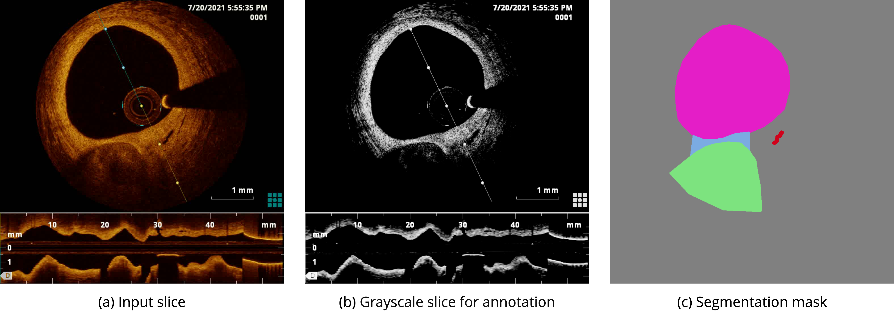
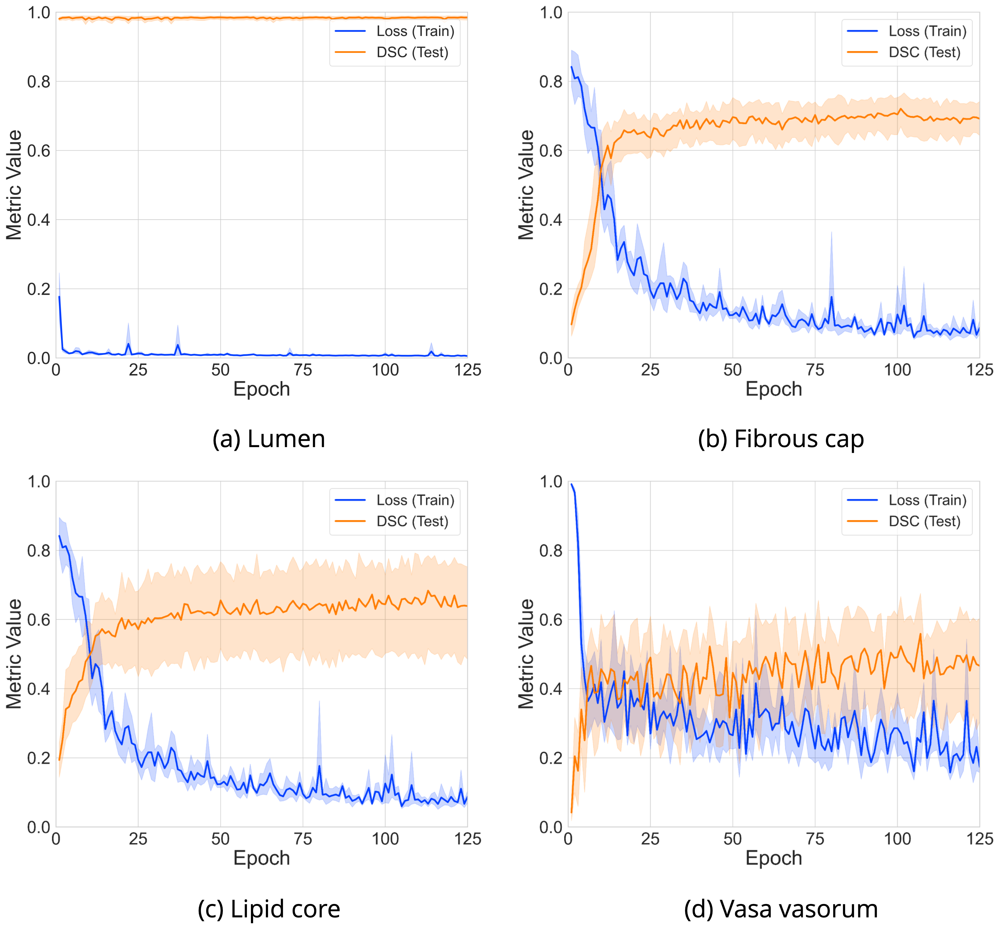
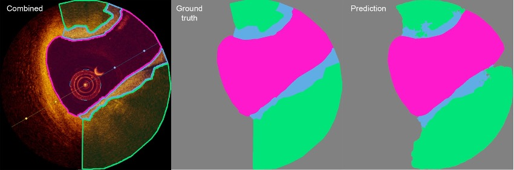
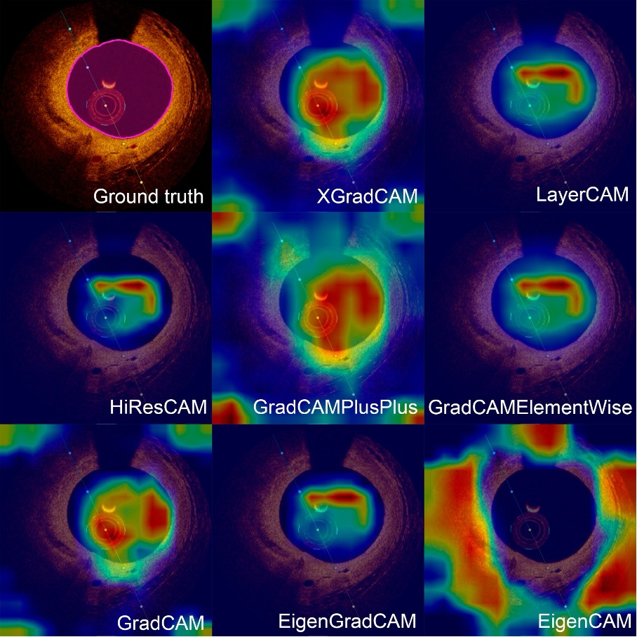

[](https://TO.BE.UPDATED.SOON)
[](https://TO.BE.UPDATED.SOON)
[](https://TO.BE.UPDATED.SOON)

# Segmentation and analysis of OCT images

<a name="contents"></a>
## 📖 Contents
- [Introduction](#introduction)
- [Data](#data)
- [Methods](#methods)
- [Results](#results)
- [Conclusion](#conclusion)
- [Requirements](#requirements)
- [Installation](#installation)
- [How to Run](#how-to-run)
- [Data Access](#data-access)
- [How to Cite](#how-to-cite)

<a name="introduction"></a>
## 🎯 Introduction
This repository provides a comprehensive approach for deep learning-based segmentation and quantification of atherosclerotic plaque features in [optical coherence tomography](https://en.wikipedia.org/wiki/Optical_coherence_tomography) (OCT) images. The accurate analysis of plaques is critical for preventing cardiovascular events and guiding therapeutic interventions. By leveraging state-of-the-art deep learning models, this project enables precise identification of lumen, fibrous cap, lipid core, and vasa vasorum features, contributing to advancements in cardiovascular diagnostics.

<a name="data"></a>
## 📁 Data
The dataset comprises OCT images from 103 patients, collected across multiple centers. These images include 25,698 annotated slices, detailing four key plaque features:

- **Lumen (LM):** Vascular opening
- **Fibrous Cap (FC):** Thin protective layer over lipid core
- **Lipid Core (LC)**: Lipid-rich region associated with vulnerable plaques
- **Vasa Vasorum (VV)**: Microvessels supplying the arterial wall

Annotations were performed by cardiologists using [Supervisely](https://supervisely.com/), with double-verification for accuracy (refer to <a href="#figure-1">Figure 1</a>). The dataset is structured for 5-fold cross-validation to ensure robust model evaluation. For more details, refer to the Dataset Repository at [https://doi.org/10.5281/zenodo.14478209](https://doi.org/10.5281/zenodo.14478209).

<p align="center">
  
</p>

<p align="left">
    <em><strong>Figure 1.</strong> Annotation methodology for optical coherence tomography images depicting plaque morphological features associated with atherosclerotic plaque development. The feature annotations delineated with segmentation masks include the lumen (pink), fibrous cap (blue), lipid core (blue), and vasa vasorum (red).</em>
</p>

<a name="methods"></a>
## 🔬 Methods
We employed nine advanced deep learning architectures — [U-Net](https://link.springer.com/chapter/10.1007/978-3-319-24574-4_28), [U-Net++](https://link.springer.com/chapter/10.1007/978-3-030-00889-5_1), [DeepLabV3](https://arxiv.org/abs/1706.05587), [DeepLabV3+](https://link.springer.com/chapter/10.1007/978-3-030-01234-2_49), [FPN](http://presentations.cocodataset.org/COCO17-Stuff-FAIR.pdf), [LinkNet](https://ieeexplore.ieee.org/document/8305148), [PSPNet](https://arxiv.org/abs/1612.01105), [PAN](https://arxiv.org/abs/1805.10180), and [MA-Net](https://ieeexplore.ieee.org/document/9201310) — to address the segmentation of atherosclerotic plaque features. To enhance performance, we applied a hybrid segmentation strategy, which involves designing specialized models for each plaque feature based on their prevalence and complexity:
- **Lumen Segmentation:** A single-class model trained exclusively for the lumen, leveraging its high representation in the dataset.
- **Fibrous Cap and Lipid Core Segmentation:** A two-class model trained jointly on these features due to their shared morphological characteristics and moderate dataset representation.
- **Vasa Vasorum Segmentation:** A separate single-class model focused on this rare feature to better capture its unique characteristics.

Each model underwent a comprehensive tuning process to optimize its performance, which included:
- **Hyperparameter Tuning:** We employed Bayesian optimization, combined with the HyperBand early stopping strategy, to explore different configurations and identify the most effective hyperparameters for each model.
- **Data Augmentation:** To enhance the robustness of the models and prevent overfitting, various augmentation techniques were applied, such as random brightness adjustments, rotations, and scaling.
- **Cross-Validation:** A 5-fold cross-validation strategy was used to partition the data, ensuring that each model was trained and evaluated on different subsets of the dataset, which prevented data leakage and helped assess model generalizability.

<a name="results"></a>
## 📈 Results - TO BE UPDATED SOON
The models exhibited varying levels of accuracy across features. U-Net++ excelled in lumen segmentation, achieving a Dice Similarity Coefficient (DSC) of 0.987. This performance reflects the advantage of a single-class model dedicated to the lumen, leveraging its high representation in the dataset to capture clear and distinct boundaries effectively.

For fibrous cap and lipid core segmentation, LinkNet performed strongly with DSCs of 0.736 and 0.751, respectively. These results highlight the effectiveness of a two-class model trained jointly on these features, allowing it to better handle their shared morphological characteristics, such as overlapping and intricate boundaries.

The segmentation of vasa vasorum, a rare and subtle feature, was tackled using a dedicated single-class U-Net model, achieving a DSC of 0.610. Despite the inherent challenges due to its sparse representation in the dataset, this approach ensured focused learning on the vasa vasorum's unique structure, yielding promising results.

An ensemble approach combining U-Net++, LinkNet, and U-Net further improved overall segmentation accuracy, achieving an average DSC of 0.882. These results demonstrate the effectiveness of tailoring model architectures and strategies to the specific requirements of each plaque feature. Performance metrics, including precision, recall, and IoU, are detailed in <a href="#table-1">Table 1</a>, with training dynamics and segmentation outcomes visualized in <a href="#figure-2">Figure 2</a>, <a href="#figure-3">Figure 3</a>, and <a href="#figure-4">Figure 4</a>.

<p align="left">
  <i><strong id="table-1">Table 1.</strong> Segmentation performance metrics for each plaque morphological feature, averaged over 5 folds.</i>
</p>

|   **PMF**    | **Precision** | **Recall** | **F1** | **IoU** | **DSC** |
|:------------:|:-------------:|:----------:|:------:|:-------:|:-------:|
|    Lumen     |     0.986     |   0.988    | 0.987  |  0.975  |  0.987  |
| Fibrous cap  |     0.737     |   0.784    | 0.736  |  0.608  |  0.736  |
|  Lipid core  |     0.815     |   0.772    | 0.751  |  0.639  |  0.751  |
| Vasa vasorum |     0.664     |   0.630    | 0.610  |  0.511  |  0.610  |
<br>

<p align="center">
  
</p>

<p align="center">
    <em><strong>Figure 2.</strong> Comparative analysis of loss and DSC evolution during training and testing phases over 5-fold cross-validation with 95% confidence interval.</em>
</p>
<br>

<p align="center">
  
</p>

<p align="center">
    <em><strong>Figure 3.</strong> Comparison between ground truth segmentation and ensemble predictions.</em>
</p>
<br>

<p align="center">
  
</p>

<p align="center">
    <em><strong>Figure 4.</strong> Class Activation Maps highlighting key regions for lumen segmentation.</em>
</p>
<br>

<a name="conclusion"></a>
## 🏁 Conclusion
This project leverages optimized machine learning models to automate atherosclerotic plaque segmentation in OCT images, achieving high accuracy for key features such as lumen (DSC: 0.987), fibrous cap (DSC: 0.736), lipid core (DSC: 0.751), and vasa vasorum (DSC: 0.610). The hybrid segmentation strategy and targeted optimization effectively handled dataset imbalances and feature complexities, ensuring robust performance across diverse plaque morphologies. This work underscores the potential of ML-driven OCT imaging in detecting vulnerable plaques, guiding interventions, and advancing cardiovascular diagnostics. Openly shared resources promote further innovation in this field.

<a name="requirements"></a>
## 💻 Requirements

- Operating System
  - [x] macOS
  - [x] Linux
  - [x] Windows (limited testing carried out)
- Python 3.11.x
- Required core libraries: [environment.yaml](environment.yaml)

<a name="installation"></a>
## ⚙ Installation

**Step 1: Install Miniconda**

Installation guide: https://docs.conda.io/projects/miniconda/en/latest/index.html#quick-command-line-install

**Step 2: Clone the repository and change the current working directory**
``` bash
git clone https://github.com/ViacheslavDanilov/oct_segmentation.git
cd oct_segmentation
```

**Step 3: Set up an environment and install the necessary packages**
``` bash
chmod +x make_env.sh
./make_env.sh
```

<a name="how-to-run"></a>
## 🚀 How to Run - TO BE UPDATED SOON

Specify the `data_path` and `save_dir` parameters in the [predict.yaml](configs/predict.yaml) configuration file. By default, all images within the specified `data_path` will be processed and saved to the `save_dir` directory.

To run the pipeline, execute [predict.py](src/models/smp/predict.py) from your IDE or command prompt with:
``` bash
python src/models/smp/predict.py
```

<a name="data-access"></a>
## 🔐 Data Access - TO BE UPDATED SOON
All essential components of the study, including the curated dataset and trained models, have been made publicly available:
- **Dataset:** [https://zenodo.org](https://zenodo.org)
- **Models:** [https://zenodo.org](https://zenodo.org)

<a name="how-to-cite"></a>
## 🖊️ How to Cite - TO BE UPDATED SOON
Please cite [OUR PAPER](https://TO.BE.UPDATED.SOON) if you found our data, methods, or results helpful for your research:

> Danilov V.V., Laptev V.V., Klyshnikov K.Yu., Ovcharenko E.A. (**2024**). _PAPER TITLE_. **Journal Title**. DOI: [TO.BE.UPDATED.SOON](TO.BE.UPDATED.SOON)
